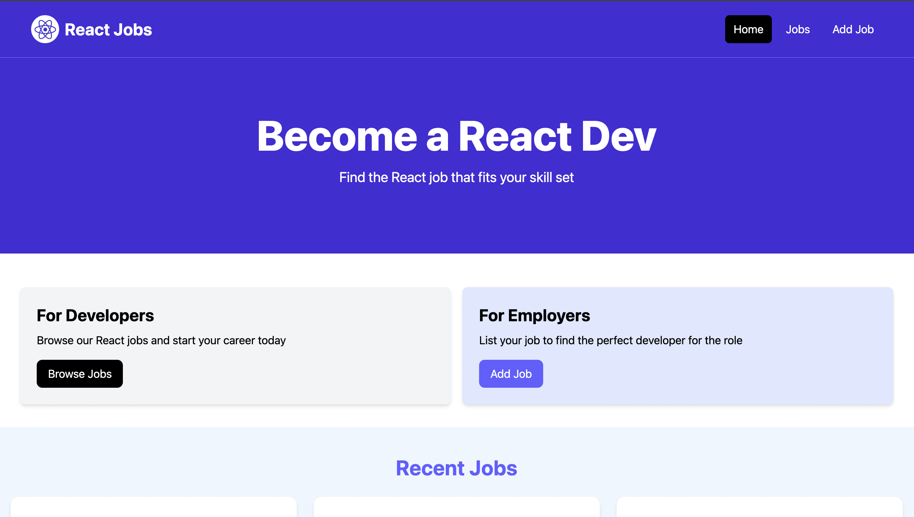
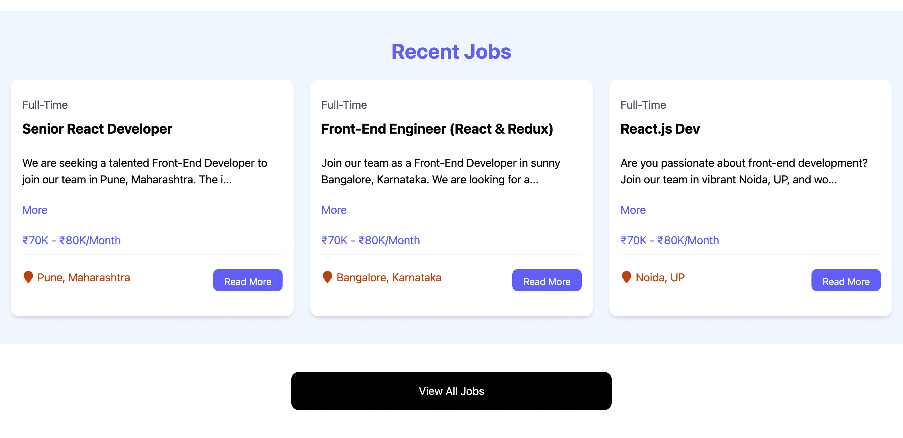
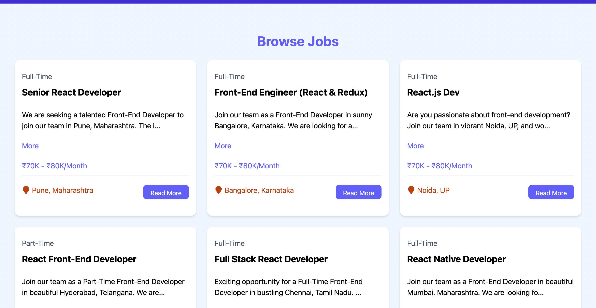
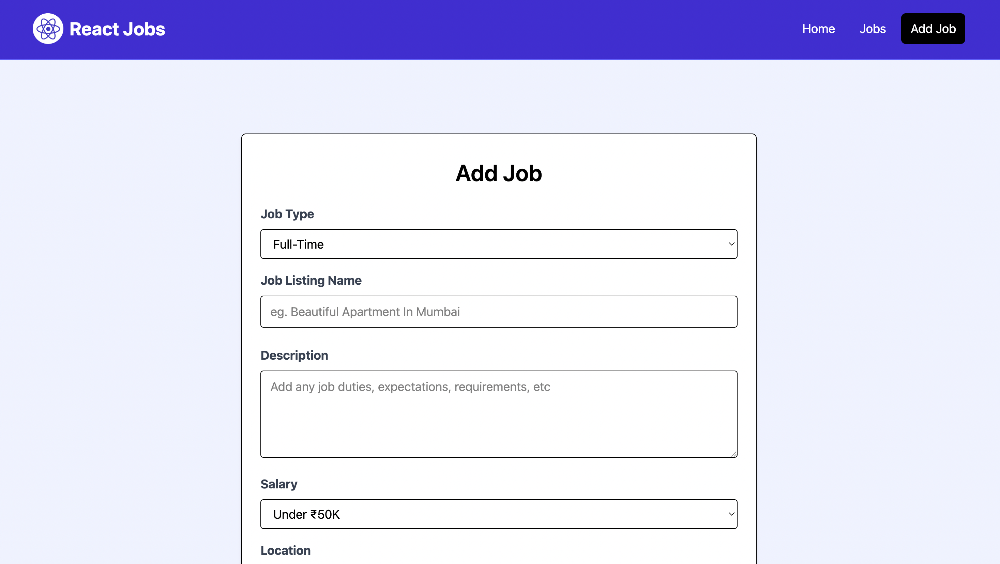
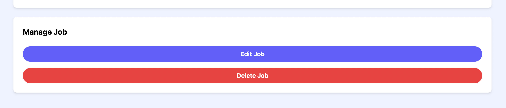
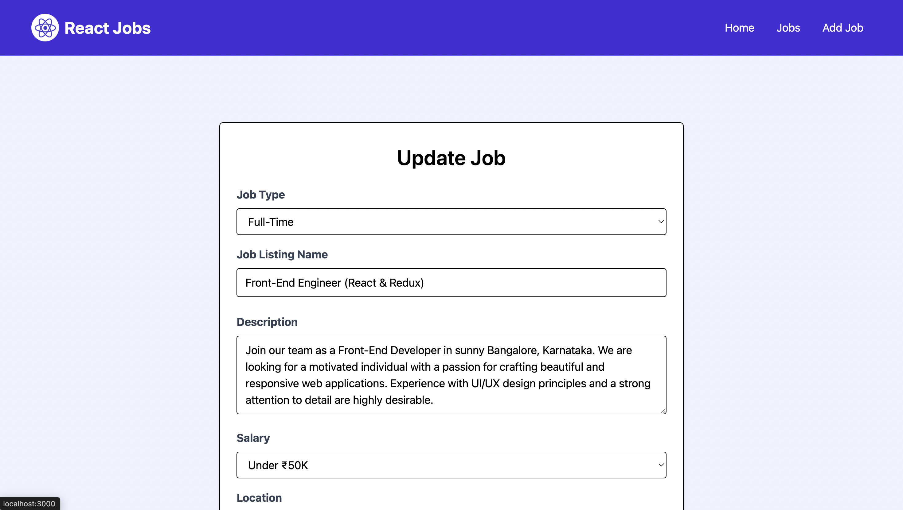

# 🧑‍💼 React Job Listing App

A simple and responsive **Job Listing Application** built with **React**, styled with **Tailwind CSS**, and powered by a mock backend (JSON Server).  
Users can browse jobs, view job details, and update job listings easily.

---

## ✨ Features
- 📃 Browse all job listings
- 🔍 View detailed job information
- 🖊️ Add, update, and delete jobs
- ⚡ Fast & responsive UI with Tailwind CSS
- 🔄 State management with React Hooks (`useState`, `useEffect`)
- 🌐 Fetch jobs from a backend API (`json-server`)

---

## 🛠️ Tech Stack
- **Frontend:** React, React Router, Tailwind CSS  
- **Backend (Mock API):** JSON Server  
- **Other Tools:** Git, ESLint, Prettier

---

## 🚀 Getting Started

### 1. Clone the repository
```bash
git clone https://github.com/noturshek/react-job-listing.git
cd react-job-listing
```

### 2. Install Dependencies
```bash
npm install
```


### 3. Run the mock backend
```bash
npm run server
```
- By default, it runs at: http://localhost:8000/jobs


### 4. Start the frontend
```bash
npm run dev
```

📂 Project Structure
```lua
react-job-listing/
├── public/ # Public assets
│ └── vite.svg
├── src/
│ ├── assets/images # Static images
│ ├── components # Reusable UI components
│ ├── layouts # Layout components
│ ├── pages # Page components (Job details, etc.)
│ ├── App.jsx # Root app component
│ ├── index.css # Global styles
│ ├── jobs.json # Mock job data
│ ├── main.jsx # Entry point
├── .gitignore
├── eslint.config.js
├── index.html
├── package.json
├── vite.config.js
└── README.md
```

## Screenshots

### Home Page


### Home Page with Browse Section


### Browse Jobs


### Add Job


### Manage Jobs


### Update Job

